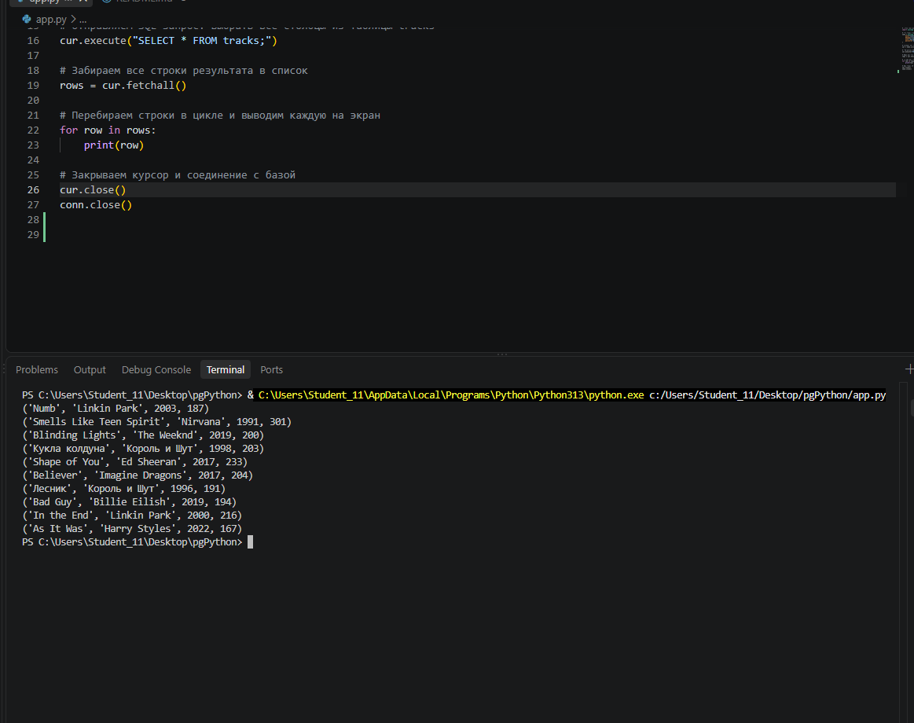
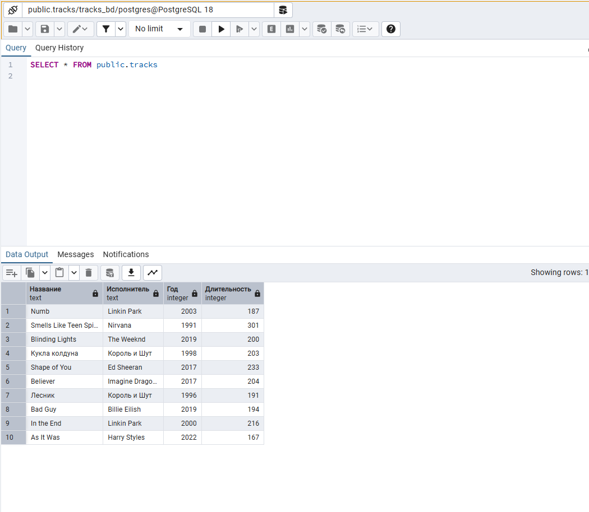
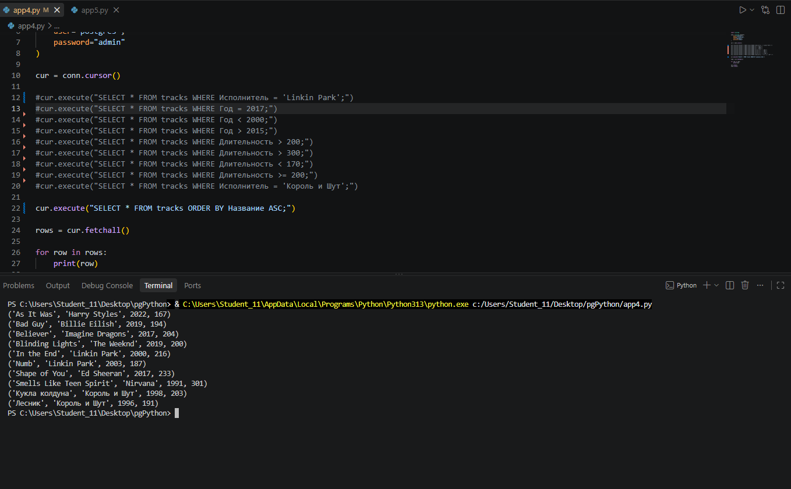
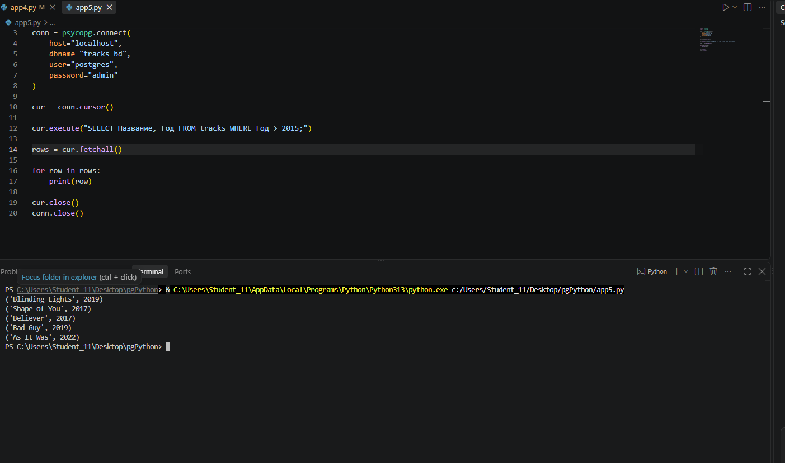
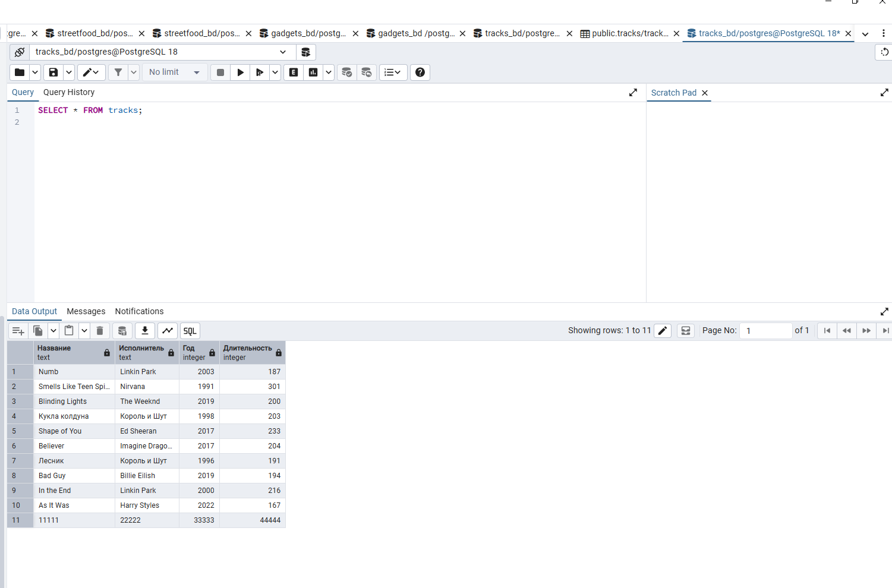

# pgPython

Проект подключается к PostgreSQL из Python и выводит строки из таблицы `tracks`.

## app.py
Выполняет запрос `SELECT * FROM tracks;` и печатает все строки.

## app2.py
Выполняет запрос `SELECT Название, Исполнитель FROM tracks;` и печатает только эти два столбца.

## app3.py
Выполняет запрос `SELECT Название, Исполнитель, Год FROM tracks;` и выводит три столбца: название, исполнитель, год.

## app4.py
Выполняет запросы с WHERE и ORDER BY (фильтрация по исполнителю, году, длительности; сортировка по названию).

## app5.py
Выполняет запрос `SELECT Название, Год FROM tracks WHERE Год > 2015;` и выводит только название и год для треков после 2015 года.

## app6.py
Запрашивает у пользователя название, исполнителя, год и длительность, добавляет новую строку в таблицу `tracks` через `INSERT` и выводит всё содержимое таблицы.

